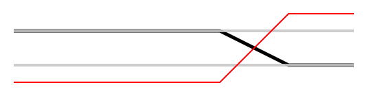

# @freder/piecewise

a library for creating composable easing and envelope functions.


## installation

```
# yarn
yarn add @freder/piecewise

# npm
npm install --save @freder/piecewise
```


## example: easing function

```javascript
const piecewise = require('@freder/piecewise');

function identity(t) {
	return t;
}

function always(c) {
	return (t) => c;
}

const piecewiseEasingFn = piecewise.easing([
	{
		tInterval: [0, 0.5],
		tMap: [0, 1], // optional
		easingFn: identity,
	},
	{
		tInterval: [0.5, 0.8],
		easingFn: always(1),
	},
	{
		tInterval: [0.8, 1],
		tMap: [1, 0], // reverse
		easingFn: identity,
	},
]);
```

`tInterval` is mapped to `tMap`, with which `easingFn` is called. `easingFn` only takes one argument `t`.

visualization:<br>


## example: envelope function

```javascript
const piecewiseEnvelopeFn = piecewise.easing([
	{
		tInterval: [0, 0.5],
		tMap: [0, 1],
		easingFn: identity,
	},
	{
		tInterval: [0.5, 1],
		tMap: [1, 0],
		easingFn: identity,
	},
]);

const finalFn = piecewise.envelope(piecewiseEnvelopeFn, piecewiseEasingFn);
```

`envelope` returns the product of the values of an envelope function and an easing function at time `t`.

visualization:<br>
<br>
grey: easing function<br>
red: envelope function<br>
black: resulting function


## example: crossfade function

```javascript
const easingFn = piecewise.easing([
	{
		tInterval: [0, 0.6],
		tMap: [0, 1],
		easingFn: always(0),
	},
	{
		tInterval: [0.6, 0.8],
		tMap: [0, 1],
		easingFn: identity,
	},
	{
		tInterval: [0.8, 1],
		tMap: [0, 1],
		easingFn: always(1),
	},
]);

const f1 = always(0.75);
const f2 = always(0.25);
const finalFn = piecewise.crossfade(easingFn, f1, f2);
```

`crossfade` mixes two functions and is controlled by `easingFn`.

visualization:<br>
<br>
grey: f1, f2<br>
red: easing function<br>
black: resulting function


## visualization

→ [visualization-example.js](./visualization-example.js)


## utility functions

```javascript
const easing = require('easing-js');
const { utils } = require('@freder/piecewise');

// wrap easing-js function to only be a function of `t`:
const wrappedEasingFn = utils.wrapEasingJsFunction(easing.linear);
wrappedEasingFn(0.7); // → 0.7
```
